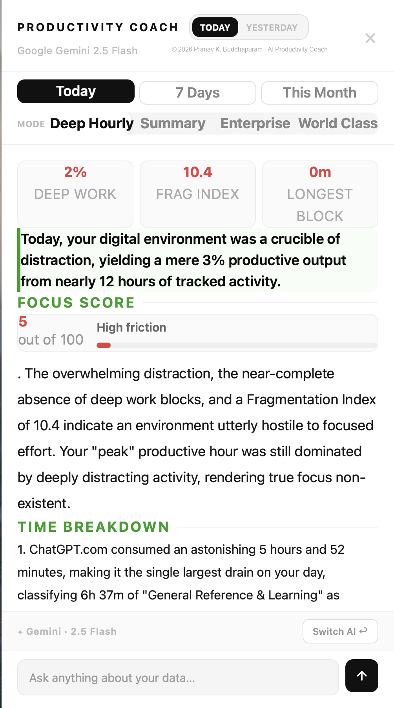
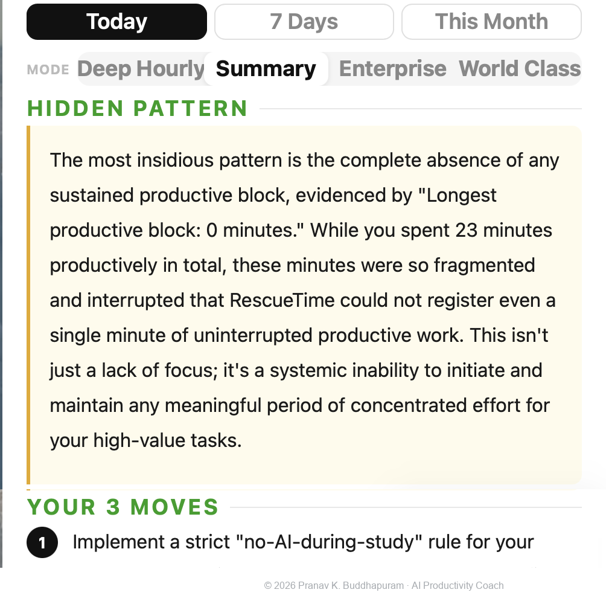
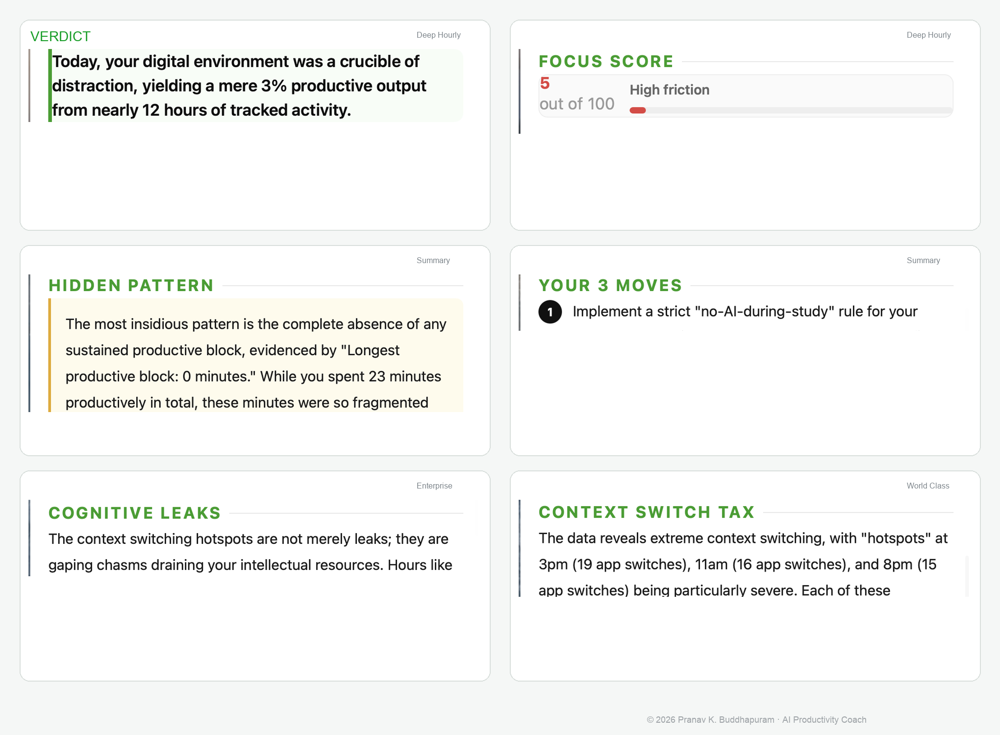
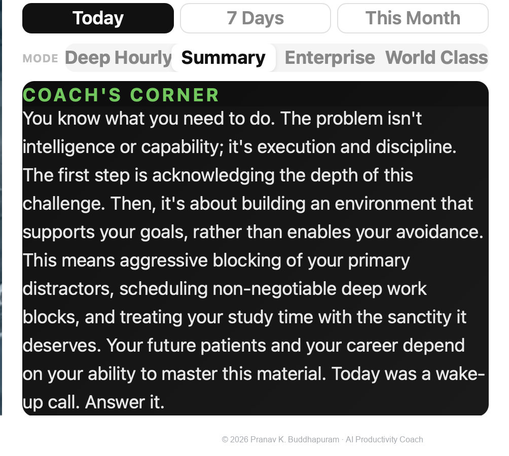

# Personal Productivity AI Coach

### Turning personal activity data into structured AI-assisted reflection during USMLE preparation

*RescueTime API integration · behavioral metrics · multi-model experimentation · context-aware coaching · AI-assisted development*

> **Portfolio case study. Source code, internal prompts, provider configuration, scoring logic, and detailed implementation are intentionally private.**

I built **Personal Productivity AI Coach** during USMLE preparation as my first experiment using RescueTime activity data as the foundation for something beyond a conventional productivity dashboard.

The idea came from a simple observation:

> **RescueTime could tell me what I was doing. I wanted another layer to help me think about what those patterns meant.**

I had also spent years reading performance and coaching literature, including Brian Klemmer's *The Compassionate Samurai*, and became interested in the difference between simply receiving information and being actively challenged to interpret it.

A dashboard can report behavior.

I wanted to explore whether an AI-assisted coach could **interpret patterns, surface less-obvious problems, and help turn observation into a concrete next action**.

  
   
  <b>Browser-side coaching interface operating alongside my normal study workflow</b>

> Screenshots reflect my own real activity data and experimental coaching output rather than demonstration content.

---

## At a Glance

| Aspect | Purpose |
|---|---|
| **Interface** | Browser-side slide-in productivity coaching panel |
| **Measurement layer** | RescueTime activity data |
| **Time windows** | Today · 7 Days · This Month |
| **Behavioral signals** | Deep-work ratio, fragmentation, longest productive block, peak/weak periods, context-switch patterns |
| **Coaching modes** | Deep Hourly · Summary · Enterprise · World Class |
| **AI layer** | Multiple language-model providers tested during development |
| **Interaction** | Structured coaching output plus follow-up questions about the same activity context |

Conceptually:

**activity data → behavioral metrics → coaching lens → AI interpretation → actionable reflection**

This was a personal experimentation project, not a validated psychological, clinical, or productivity-assessment instrument.

---

# From Activity Data to Coaching

After selecting a time window and coaching mode, the tool transformed RescueTime activity data into a structured behavioral summary before sending that context to the AI layer.

The interface surfaced signals such as:

- deep-work ratio,
- fragmentation and context switching,
- longest productive block,
- productive versus distracting activity,
- stronger and weaker periods,
- and application-level patterns.

  
   
  <b>Structured behavioral metrics paired with AI-assisted coaching</b>

The purpose was not to treat any one score as absolute truth.

The metrics simply gave the model a more structured picture than a raw list of applications and durations, allowing the conversation to move from:

**“What did I use?”**

toward:

**“What pattern does this activity suggest, and what should I change next?”**

---

## Beyond Summarizing the Data

One of the most useful ideas in the project was the **HIDDEN PATTERN** section.

A low productivity percentage alone is not especially informative.

But combining several signals — for example, short productive sessions, frequent context switching, and the absence of a sustained work block — can suggest a very different picture of how the day unfolded.

  
   
  <b>Moving from behavioral pattern recognition toward specific next actions</b>

That distinction became central to the project:

> **A dashboard reports. A coach interprets, challenges, reframes, and asks what should change next.**

---

## Multiple Coaching Lenses

As the project evolved, I found that one style of analysis did not fit every question.

I therefore experimented with four coaching lenses:

- **Deep Hourly** — granular examination of activity, productive periods, and fragmentation
- **Summary** — concise synthesis of major patterns and next actions
- **Enterprise** — operational view of recurring friction, allocation, and systemic patterns
- **World Class** — experimental performance-oriented interpretation using broader coaching frameworks

  
   
  <b>Different coaching lenses applied to the same underlying behavioral record</b>

The modes deliberately emphasized different questions while working from the same underlying activity data.

The **World Class** mode was exploratory. Some generated outputs incorporated external frameworks, authors, or numerical benchmarks supplied through the coaching context. I do **not** present those generated comparisons as independently validated performance standards.

---

# The Most Interesting Insight: AI Could Become the Distraction

One of the most memorable patterns surfaced by the project was also an uncomfortable one:

> **AI use could look productive while still displacing the work I had actually intended to do.**

Reading, experimenting, prompting, and building could all feel intellectually productive.

But during dedicated exam preparation, the more important question was:

> **Was this activity helping the primary goal at that moment?**

The coach repeatedly surfaced periods in which extensive use of AI tools competed with direct engagement with my core study material.

That created an interesting irony:

**an AI-based coaching system was helping expose excessive AI use.**

  
   
  <b>A more direct coaching view focused on interpreting behavior rather than merely reporting it</b>

That insight gradually changed how I approached productivity.

I increasingly relied on stronger environmental controls and a more structured study routine. As those systems became more consistent, I used the AI Coach less frequently.

The progression became:

**awareness → interpretation → coaching → environmental control → routine**

The goal was never permanent dependence on an AI coach.

A better outcome was reaching the point where I needed it less.

---

<strong>Development Progression & Technical Notes</strong>

 

### Development progression

This was the first RescueTime/API-based tool I built.

The early versions were relatively simple. Through repeated real-world use, the project gradually accumulated:

- RescueTime API integration,
- multiple time-window views,
- calculated behavioral metrics,
- several coaching modes,
- multi-provider AI experimentation,
- structured mode-specific responses,
- follow-up questions using the same activity context,
- loading and error-handling behavior,
- and substantial interface refinement.

Daily use exposed edge cases involving data interpretation, provider behavior, response structure, interface state, and changing API availability.

The tool therefore evolved through repeated cycles of:

**define → implement → test → identify failure → revise → validate**

### Technical snapshot

| Aspect | Detail |
|---|---|
| **Platform** | Browser-based JavaScript userscript |
| **Data source** | RescueTime API using my own activity data |
| **Interface** | Slide-in browser coaching panel |
| **Analysis windows** | Today · 7 Days · This Month |
| **AI architecture** | Multi-provider experimentation |
| **Source availability** | Private |

Exact prompts, provider routing, metric formulas, thresholds, preprocessing logic, API handling, and implementation architecture remain private.

---

## AI-Assisted Development

I did not hand-code the entire application from scratch.

I defined the problem, desired coaching behavior, metrics, interface, constraints, and edge cases; used AI coding systems to generate and revise implementations; and repeatedly tested the result against my own real activity data.

My role centered on:

**problem definition → specification → AI-assisted implementation → testing → failure detection → debugging direction → validation → refinement**

The exact model orchestration, prompts, handoffs, provider strategy, and private development workflow are intentionally not published.

What I am showcasing is the process of turning a personal behavioral problem into a working analytical tool through **system thinking, AI-assisted development, experimentation, testing, debugging, and sustained refinement**.

---

## Current Limitations

This project is a **personal exploratory tool**, not a validated psychological, clinical, cognitive, or productivity-assessment instrument.

AI-generated interpretations can sound more certain than the underlying data warrants.

The system cannot determine with certainty:

- whether an apparently productive activity was actually useful,
- whether an application supported or competed with the user's primary goal,
- whether a behavioral pattern reflects attention, motivation, fatigue, or another cause,
- or whether a generated recommendation would improve performance.

I therefore treated the coaching as a **prompt for reflection and experimentation**, not as an objective diagnosis of behavior.

---

## Project Status

**Personal-use experimental tool / portfolio case study**

The production source code and detailed implementation remain private.

Not published:

- API credentials or configuration,
- internal prompts,
- provider-routing logic,
- metric formulas,
- thresholds and scoring logic,
- preprocessing architecture,
- detailed RescueTime API handling,
- or private activity data beyond selected portfolio examples.

The repository demonstrates the project's **purpose, interface, development process, and real-world use** without publishing the implementation required to reproduce it.

---

## Author

**Pranav Krishna Buddhapuram**

Orthopaedic surgeon with interests in medical education, research, productivity systems, data-informed self-improvement, behavioral analytics, and practical AI-assisted software development.

---

## Intellectual Property

© 2026 Pranav Krishna Buddhapuram. All rights reserved.

This repository is a portfolio showcase only. No license is granted for copying, reproducing, redistributing, modifying, reverse-engineering, derivative implementation, or commercial use.
